# SentinelFly: Drone Security Analyst Agent

SentinelFly is an AI-powered drone security analysis platform that simulates autonomous surveillance operations, indexes security events, generates alerts, and enables grounded investigation through local AI reasoning.

The system combines structured event storage, semantic vector retrieval, and local LLM-powered analysis to help security operators investigate suspicious activity captured through simulated drone patrols.

---

## Problem Statement

Property owners and security teams often need to monitor large areas continuously while quickly identifying suspicious activities.

SentinelFly automates this process by:

- Processing simulated drone telemetry and surveillance observations
- Detecting objects, activities, and contextual security events
- Generating threat-scored alerts
- Indexing events for retrieval and investigation
- Providing AI-assisted analysis over historical surveillance data

---

## Key Features

### Real-Time Surveillance Processing
- Simulated drone telemetry ingestion
- Simulated video frame analysis
- Context-aware event generation

### Security Alert Engine
- Threat scoring
- Loitering detection
- Restricted area violations
- Repeated suspicious vehicle appearances
- After-hours activity detection

### Event Indexing
- SQLite structured event storage
- Frame-by-frame event indexing
- Queryable by object, location, and timestamp

### Semantic Memory
- ChromaDB vector database
- Embedding-based retrieval
- Cross-event contextual search

### Investigation Assistant
- RAG-style evidence retrieval
- Grounded responses using SQLite + Chroma evidence
- Local LLM reasoning using Ollama phi3

### Incident Replay
- Timeline reconstruction
- Event sequence review
- Pattern identification

### Security Briefing
- Daily AI-generated security summaries
- Executive-level operational overview

## System Architecture

SentinelFly processes simulated drone telemetry and surveillance frame descriptions through an event processing pipeline. Generated events are stored in SQLite for structured querying and indexed in ChromaDB for semantic retrieval.

The Investigation Assistant uses Retrieval-Augmented Generation (RAG) to combine evidence from both stores before generating grounded responses through a local Ollama phi3 model. The indexed event data powers alerts, incident replay, entity tracking, and daily security briefings.

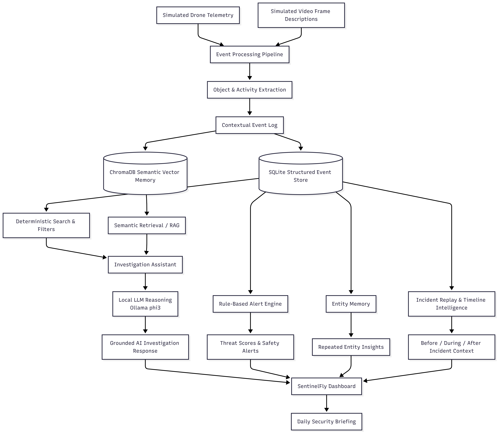

## Screenshots

### Dashboard

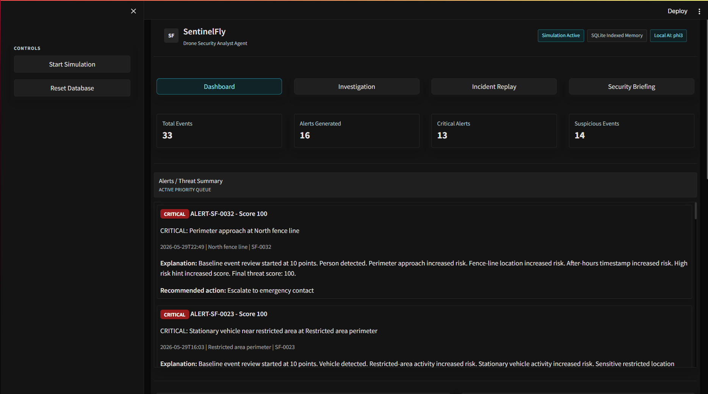

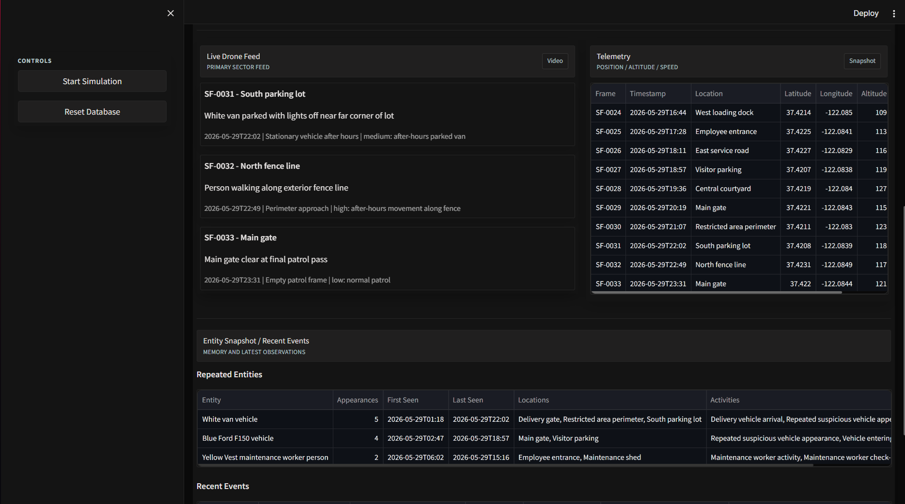

### Investigation Assistant

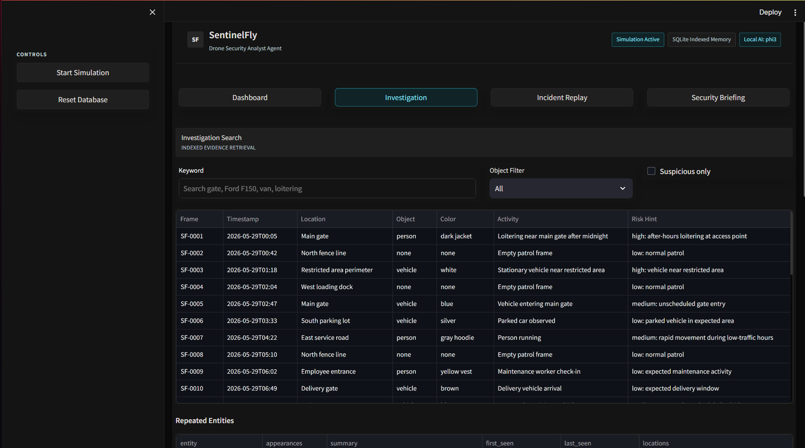

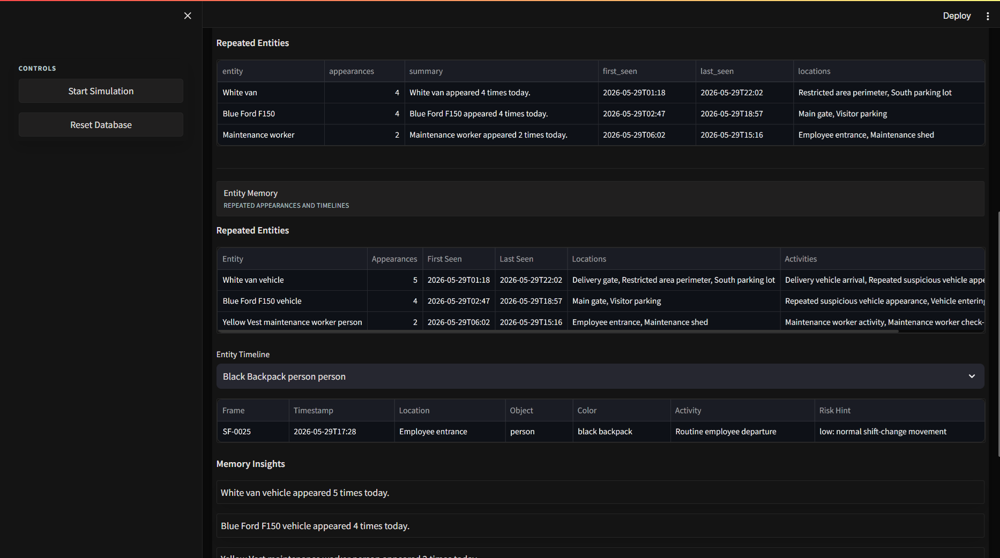

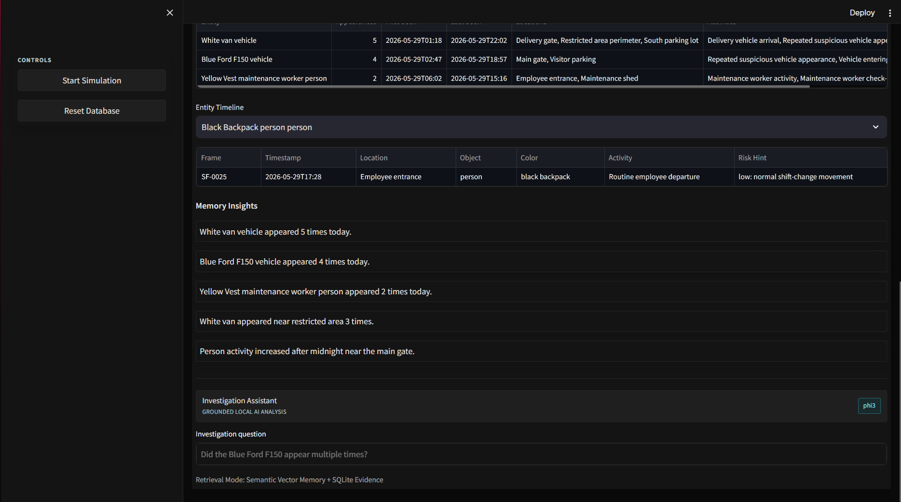

### Incident Replay

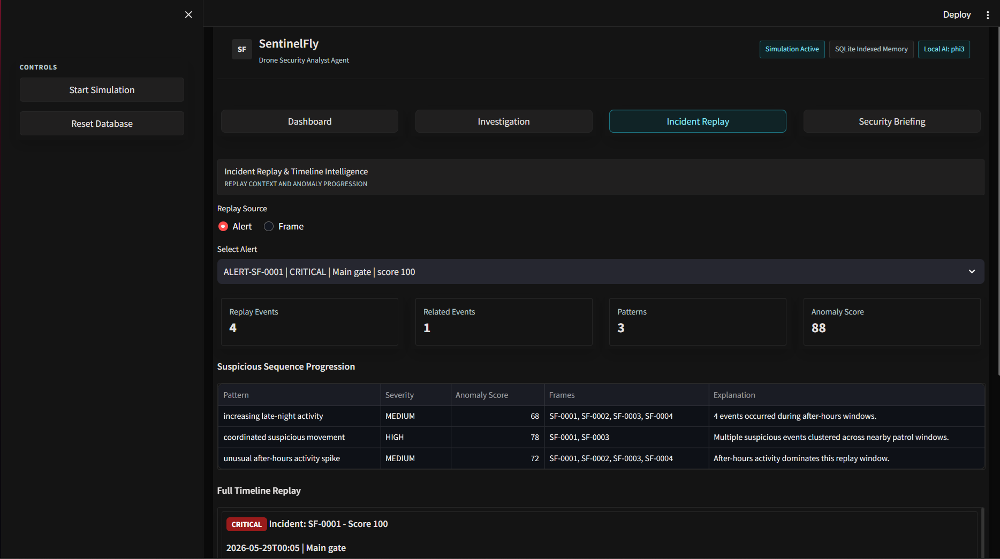

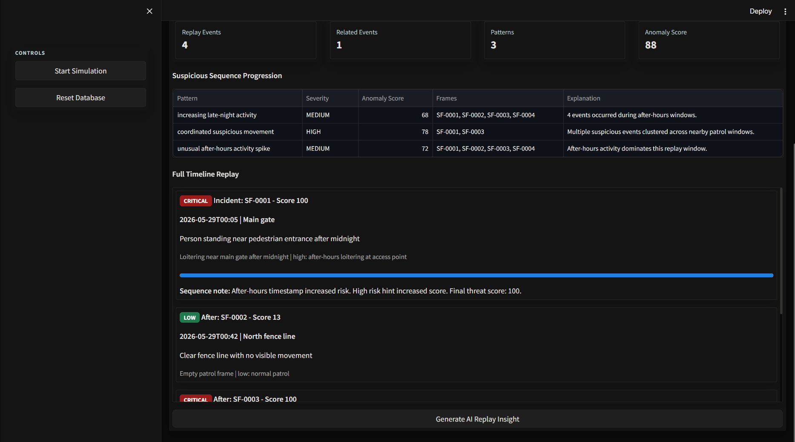

### Security Briefing

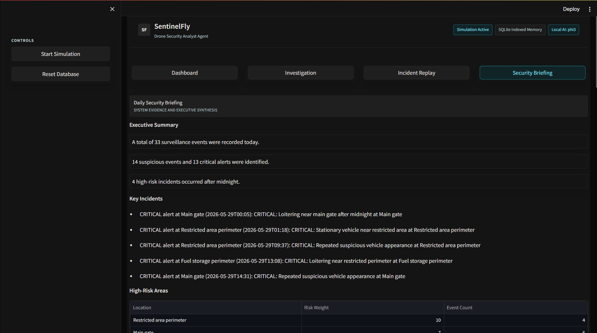

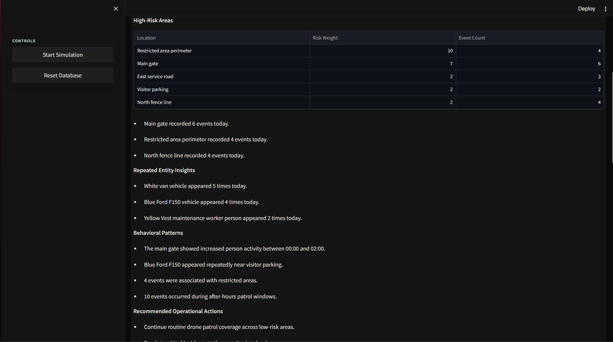

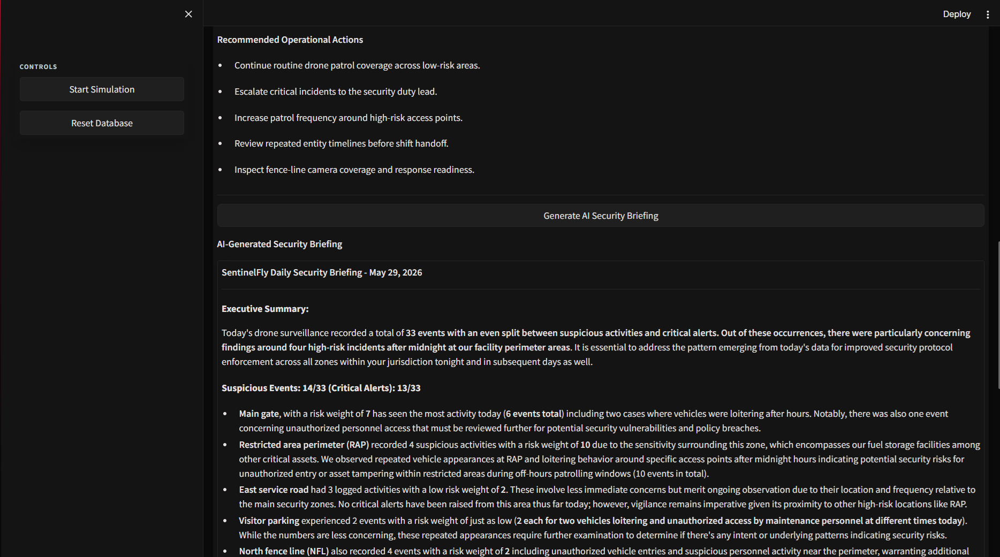

---

## QA / Test Cases

| Test Case | Expected Result |
|------------|----------------|
| Blue vehicle appears at gate | Event logged correctly |
| Person loitering after midnight | Alert generated |
| Query "white van" | Matching events retrieved |
| Query repeated entity | Entity memory displayed |
| Generate security briefing | AI summary produced |
| Incident replay | Timeline reconstructed |
| Threat scoring | Risk levels assigned correctly |
| Semantic investigation query | Relevant evidence retrieved |

---

## Assignment Requirements Mapping

| Requirement | Status |
|------------|---------|
| Process simulated drone telemetry data | ✅ Implemented |
| Process simulated video frame descriptions | ✅ Implemented |
| Identify objects and events with context | ✅ Implemented |
| Generate real-time security alerts | ✅ Implemented |
| Frame-by-frame indexing | ✅ Implemented |
| Query indexed events by object or timestamp | ✅ Implemented |
| AI-assisted implementation | ✅ Implemented |
| QA testing | ✅ Implemented |

---

## Future Improvements

- Integration with real drone telemetry streams
- Real-time VLM-based frame analysis
- Multi-drone fleet coordination
- Advanced anomaly detection models
- Cloud deployment
- Automated incident escalation workflows

---
